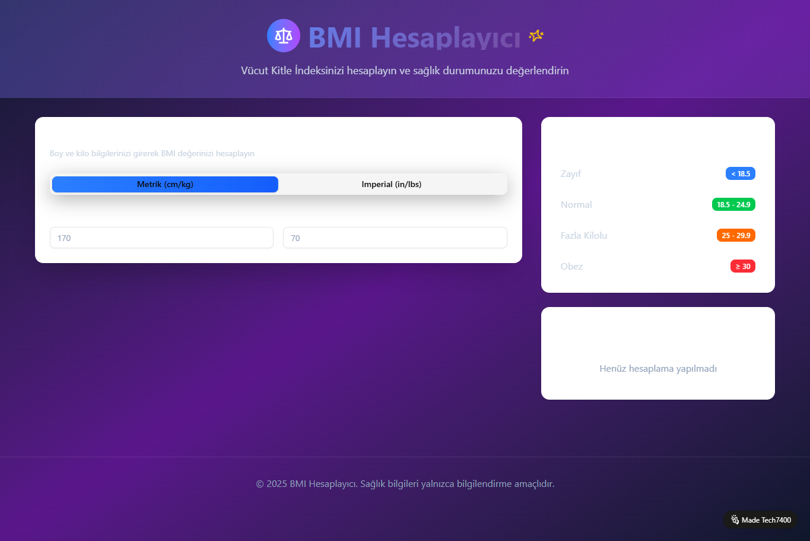

# TECH7400 BMI Calculator
Responsive BMI Calculator customized by TECH7400

This is a responsive and interactive Body Mass Index (BMI) calculator, customized and branded by **TECH7400**.

Originally inspired by an open-source template, this version has been **heavily modified** in design, layout, functionality, and branding to fit TECH7400’s portfolio and UX goals.

### 🛠️ Technologies Used:
- HTML
- CSS
- JavaScript

### 🔍 Features:
- Responsive layout
- Real-time BMI calculation
- Dynamic visual feedback
- Clean UI adapted for mobile and desktop

---

> ⚙️ Developed, customized and deployed as part of TECH7400's showcase projects.

📫 LinkedIn: [Levent E.](https://www.linkedin.com/in/levent-erdost-2b0784201)  
💻 GitHub: [@levo-tech7400](https://github.com/levo-tech7400)
